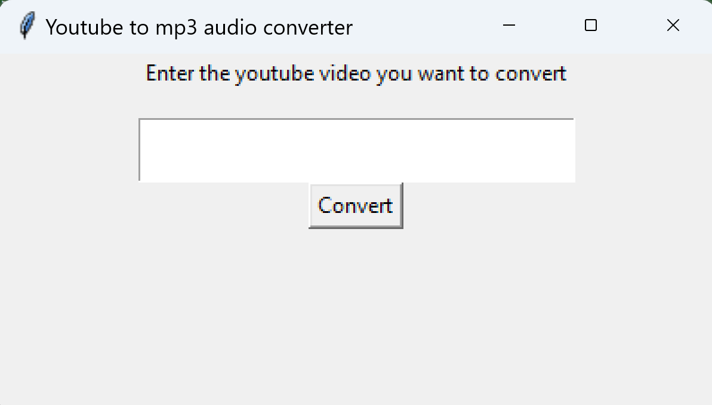
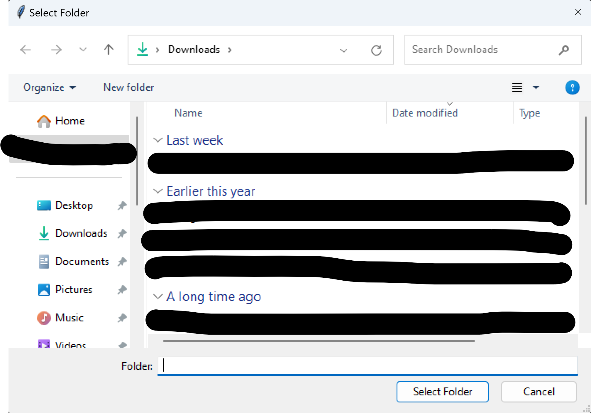
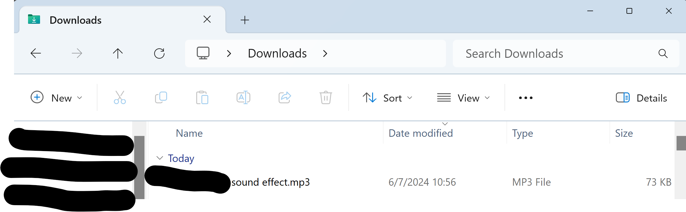

# Youtube to Mp3 Downloader (and in the future other audio file formats)
* Script and a GUI to download youtube videos as audio only mp3 files

# Dependencies Needed
* Pytube, MoviePy, Tkinter and Requests

# About this Project
* The origin behind this project was to extract audio from youtube video without the idea of going to third party websites (with the possibility of the sites stealing your information). This was the first time I utilized tkinter and further stepping into GUI development.

Upon running the python script, a window will pop up asking you to input your youtube link

Once the link is entered in a window will show asking where you want to place your song

There is the mp3 version of your sound
