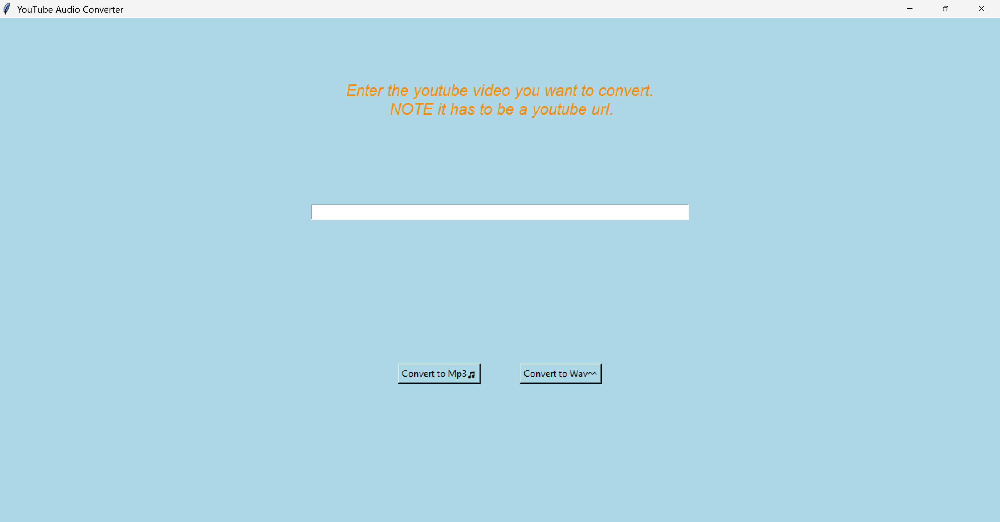

# Youtube to Mp3 Downloader GUI
* Script and a GUI to download youtube videos as audio only mp3 and wav files

# Dependencies Needed
* Yt-dlp, MoviePy, Tkinter and Requests as well as the other dependencies in the requirements.txt file below

# About this Project
* The origin behind this project was to extract audio from youtube video without the idea of going to third party websites (with the possibility of the sites stealing your information). This was the first time I utilized tkinter and further stepping into GUI development.

* Upon running the executable listed in the release, a window will pop up asking you to input your youtube link. You also have two options, convert the following youtube link to an mp3 file OR an wav file.

* Once the link is entered in and an option is selected, a window will pop up and ask you where you want to place your downloaded file (either mp3 format or wav format)

* Depending on which file type you choose to convert and the folder you select your file to be located in, you will be able to find the downloaded wav/mp3 file in your folder you placed it in

* Feel free to place an issue in the issues section if you have any questions or suggestions.
* Releases will always be updated and located in <a href="https://github.com/mwang840/YtAudioConverter/releases">this link</a>